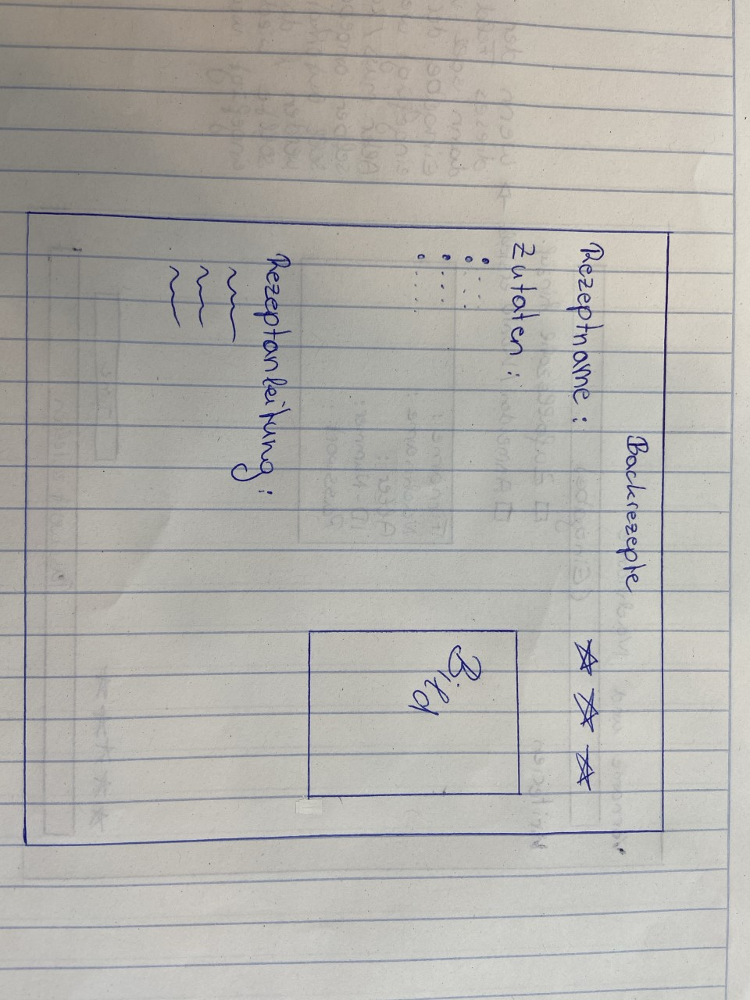
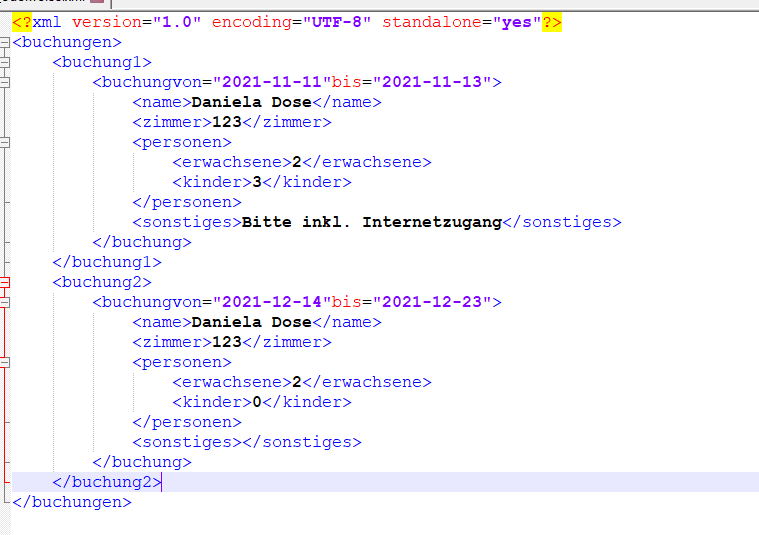
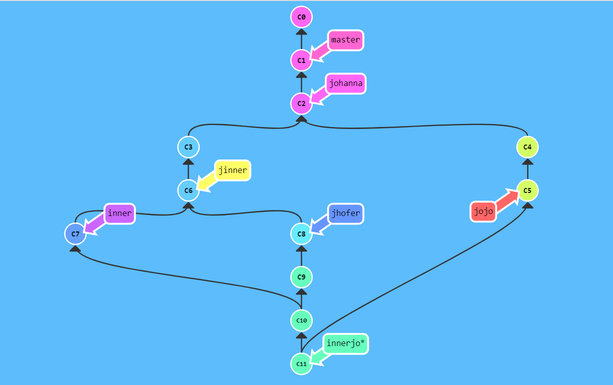
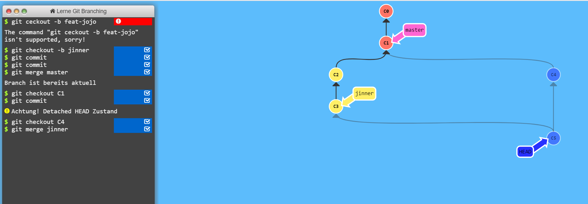

#Backrezepte
Protokoll:

vom 27.10.2020 bis zum 11.11.2020 wurde das Projekt heruntergeladen, in ein eigenes Repository gespeichert und die MainView wurde designed.

Arbeitsauftrag für 2020-11-12
	-Design selber gestalten

Arbeitsauftrag für 2020-11-20
	-uebung edelweiss

Arbeitsauftrag für 2020-12-11

Uebung 2

Uebung 3

Arbeitsauftrag für 2020-12-18
	-Wiederholung XML

Arbeitsauftrag 2020-01-14/15
	-Daten speichern und auslesen

Arbeitsauftrag für 2021-01-21/22
	-XML speichern und lesen

